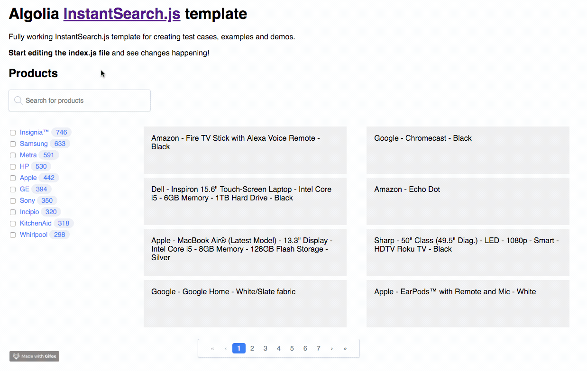

# InstantSearch templates

<!-- START doctoc generated TOC please keep comment here to allow auto update -->
<!-- DON'T EDIT THIS SECTION, INSTEAD RE-RUN doctoc TO UPDATE -->
**Table of Contents**  *generated with [DocToc](https://github.com/thlorenz/doctoc)*

- [What is this?](#what-is-this)
- [Goal](#goal)
- [CodeSandbox links](#codesandbox-links)
- [Running examples locally](#running-examples-locally)
- [Future of this repository](#future-of-this-repository)

<!-- END doctoc generated TOC please keep comment here to allow auto update -->

## What is this?

This repository holds a set of starter templates for all the projects of the InstantSearch team at Algolia.

All the templates are displaying the same search UI:


The JavaScript client and helper templates **are not full search UIs** because we do
not recommend you to use them for that. But we still provide quick templates for those
so that you can demonstrate bugs when needed.

## Goal

The goal is to use those templates in any situation where:
- as a user, you want to showcase us some code example
- as a user, you want to showcase us a bug in our libraries
- as a contributor, you want to ask a user to show us a bug
- you just want to kickstart a demo
- those templates are also linked inside our [GitHub issue templates](https://github.com/blog/2111-issue-and-pull-request-templates)

This repository is automatically linked to [CodeSandbox](https://codesandbox.io/), so all
examples are available inside a nice online code editor with live preview.

If the repository is updated, the online examples will be updated too, very handy!

## CodeSandbox links

Here are the CodeSandbox links for all projects:
- [InstantSearch.js](https://codesandbox.io/s/github/algolia/instantsearch-templates/tree/master/src/InstantSearch.js)
- [React InstantSearch](https://codesandbox.io/s/github/algolia/instantsearch-templates/tree/master/src/React%20InstantSearch)
- [Angular InstantSearch](https://codesandbox.io/s/github/algolia/instantsearch-templates/tree/master/src/Angular%20InstantSearch) (TODO)
- [Vue InstantSearch](https://codesandbox.io/s/github/algolia/instantsearch-templates/tree/master/src/Vue%20InstantSearch) (TODO)
- [JavaScript client](https://codesandbox.io/s/github/algolia/instantsearch-templates/tree/master/src/JavaScript%20client)
- [JavaScript helper](https://codesandbox.io/s/github/algolia/instantsearch-templates/tree/master/src/JavaScript%20helper)

## Running examples locally

Requirements:
- Node.js >= v9.4.0, use nvm - [install instructions](https://github.com/creationix/nvm#install-script)
- Yarn >= v1.3.2 - [install instructions](https://yarnpkg.com/en/docs/install#alternatives-tab)


```
cd ~/Dev
git clone git@github.com:algolia/instantsearch-templates.git
cd instantsearch-templates
yarn
yarn isjs # InstantSearch.js
yarn ris # React InstantSearch
yarn ais # Angular InstantSearch
yarn vis # Vue InstantSearch
yarn jsclient # JavaScript client
yarn jshelper # JavaScript helper
```

## Future of this repository

We could use those templates in our upcoming create-is-app, thoughts?
